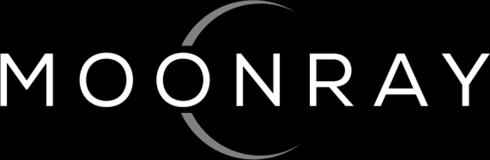

[Website](https://openmoonray.org) |
[Discussion Forum](https://github.com/dreamworksanimation/openmoonray/discussions) |
[Documentation](https://docs.openmoonray.org) |
[Releases](https://github.com/dreamworksanimation/openmoonray/releases) |
[License](https://www.apache.org/licenses/LICENSE-2.0)

INTRO OPTION 1:

MoonRay is an open source, efficient production MCRT path-tracing renderer supporting CPU and hybrid GPU (XPU) in batch and interactive applications, as well as multi-machine and cloud rendering via the Arras distributed computation framework. It was developed at DreamWorks for use in [feature film animation](https://openmoonray.org/documentation) and rendering as a service applications and includes an extensive library of production-tested, physically based materials, a USD Hydra render delegate as well as tools for regresssion testing, performance monitoring and more.


INTRO OPTION 2:

MoonRay efficiently renders images for animation, visual effects and other uses based on it's own internal or USD scene description formats.  It was open sourced by DreamWorks and is in active use for [feature film animation](https://openmoonray.org/documentation).  You can take advantage of an extensive library of production-tested, physically based materials, a USD Hydra render delegate, and local, multi-machine and cloud rendering for interactive and batch rendering.  It runs on CPU and hybrid GPU (XPU) hardware and has tools for regression testing, performance monitoring and more.

### License

MoonRay is released under the [Apache License, Version 2.0](https://www.apache.org/licenses/LICENSE-2.0), which is a free, open source software license developed and maintained by the Apache Software Foundation.

### Contributions

MoonRay welcomes contributions to the project. Please refer to the contribution guidelines for details on how to make a contribution.

### Cloning
This is the top-level repository for MoonRay opensource. The actual source code is contained in a number of other repositories referenced here as git submodules.

To clone this repository along with the submodules:
```bash
git clone --recurse-submodules https://github.com/dreamworksanimation/openmoonray.git
```

### Building
You can get started building MoonRay on Linux or MacOS, or a container by reading the [Building MoonRay](https://docs.openmoonray.org/getting-started/installation/building-moonray/) documentatation website.   

*** Note it would be great to add in a direct quick start to building instructions inline.


### Developer Quick Start
A helpful start will be at [understanding the structure of the source code](https://docs.openmoonray.org/developer-reference/source-structure/) followed by the overall [Developer's Guide](https://docs.openmoonray.org/developer-reference/)

